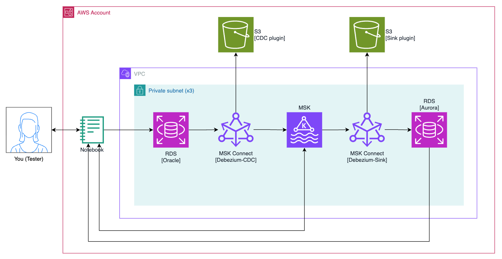

# Sample Debezium CDC - Oracle to Aurora con medición de latencia

Este repositorio demuestra un pipeline de Change Data Capture (CDC) desde Oracle RDS hasta Aurora PostgreSQL usando Debezium y Amazon MSK. El **propósito principal** es **medir la latencia end-to-end** de la replicación: desde el commit en Oracle hasta la escritura en Aurora.

Características principales:

- **CDC con Debezium Oracle Connector** – Captura cambios en tiempo real desde Oracle RDS
- **Kafka como bus de eventos** – Amazon MSK para el streaming de eventos CDC
- **Debezium JDBC Sink** – Escribe eventos en Aurora PostgreSQL
- **Medición de latencia** – Columnas `_source_ts_ms` y `_sink_ts_ms` para calcular latencia en milisegundos

**Arquitectura:**



El flujo es: **Oracle RDS** → **Debezium Oracle CDC** (MSK Connect) → **Kafka** → **Debezium JDBC Sink** (MSK Connect) → **Aurora PostgreSQL**. El notebook `4 CDC Latency.ipynb` consulta Aurora para calcular `latency_ms = _sink_ts_ms - _source_ts_ms`.

## Implementación

Sigue estos pasos para desplegar el stack completo y medir la latencia CDC.

> [!NOTE]
> Configura tus credenciales de AWS antes de comenzar.
> En este tutorial se usa el script `scripts/stack` para desplegar stacks. Asegúrate de que sea ejecutable: `chmod +x scripts/stack`
> Todas las operaciones se ejecutan desde la raíz del proyecto.

### 0. Configurar credenciales de AWS

```bash
export AWS_ACCESS_KEY_ID="<AWS_ACCESS_KEY_ID>"
export AWS_SECRET_ACCESS_KEY="<AWS_SECRET_ACCESS_KEY>"
export AWS_SESSION_TOKEN="<AWS_SESSION_TOKEN>"
```

### 1. Desplegar el stack VPC

```bash
./scripts/stack deploy 1-vpc
```

Ingresa el nombre del deployment cuando se solicite. Confirma con `yes`.

### 2. Desplegar en paralelo: db, datagenerator, kafka

Ejecuta estos tres stacks en paralelo (en terminales separadas o en segundo plano):

```bash
./scripts/stack deploy 2-db &
./scripts/stack deploy 3-datagenerator &
./scripts/stack deploy 4-kafka &
wait
```

### 3. Ejecutar el notebook 0

1. Entra a la instancia de SageMaker Notebook desde la consola de AWS.
2. Abre Jupyter Notebook.
3. Ejecuta el notebook **`0 Setup supplemental-logging.ipynb` para habilitar supplemental logging en Oracle** (requerido para Debezium CDC).

### 4. Desplegar en paralelo: debezium-cdc y aurora

```bash
./scripts/stack deploy 5-debezium-cdc &
./scripts/stack deploy 6-aurora &
wait
```

### 5. Desplegar el stack debezium-sink

```bash
./scripts/stack deploy 7-debezium-sink
```

Este connector consume de Kafka y escribe en Aurora PostgreSQL.

### 6. Ejecutar los notebooks 1 y 2

En Jupyter Notebook:

1. **`1 Download data.ipynb`** – Descarga el dataset MovieLens (tags).
2. **`2 SQL Loader.ipynb`** – Carga los tags en Oracle RDS.

Con esto se generan cambios en Oracle que se propagan por el pipeline CDC hasta Aurora.

### 7. Medir la latencia CDC

Ejecuta el notebook **`4 CDC Latency.ipynb`** para consultar Aurora y calcular la latencia end-to-end (`_sink_ts_ms - _source_ts_ms`).

## Destruir el stack

Destruye en orden inverso al despliegue:

```bash
./scripts/stack destroy 7-debezium-sink
./scripts/stack destroy 6-aurora
./scripts/stack destroy 5-debezium-cdc
./scripts/stack destroy 4-kafka
./scripts/stack destroy 3-datagenerator
./scripts/stack destroy 2-db
./scripts/stack destroy 1-vpc
```

> [!TIP]
> Si no pasas el nombre del stack, el script mostrará un menú interactivo. Al elegir del menú se usa `--auto-approve` automáticamente.

## Ver logs del connector MSK Connect

```bash
aws logs tail "/aws/msk-connect/jdbc-sink-<deployment_name>" --follow
```

## Estructura del proyecto

```
deployment/
├── 1-vpc/          # VPC, subnets, endpoints
├── 2-db/           # Oracle RDS (fuente CDC)
├── 3-datagenerator/ # SageMaker Notebook
├── 4-kafka/        # Amazon MSK
├── 5-debezium-cdc/ # Debezium Oracle CDC connector
├── 6-aurora/       # Aurora PostgreSQL (destino)
└── 7-debezium-sink/ # Debezium JDBC Sink connector

notebooks/
├── 0 Setup supplemental-logging.ipynb  # Habilita supplemental logging en Oracle
├── 1 Download data.ipynb               # Descarga dataset MovieLens
├── 2 SQL Loader.ipynb                  # Carga tags en Oracle
├── 3 Kafka CDC Consumer.ipynb          # Consume eventos CDC desde Kafka
└── 4 CDC Latency.ipynb                # Mide latencia Oracle → Aurora
```
